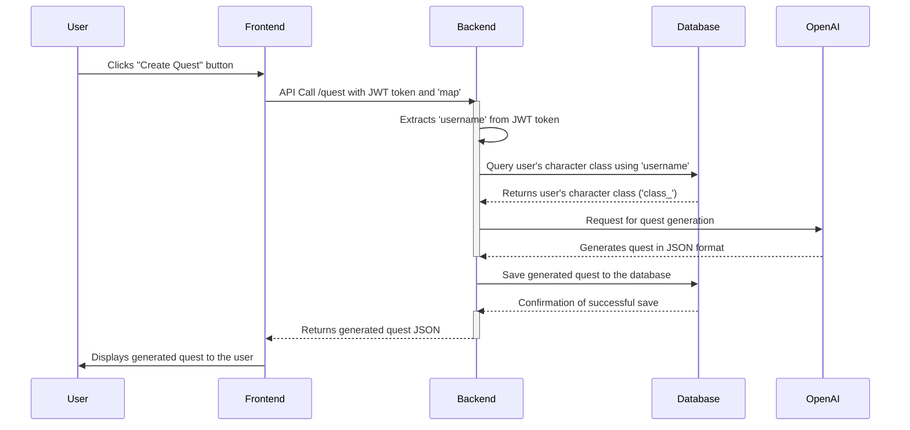
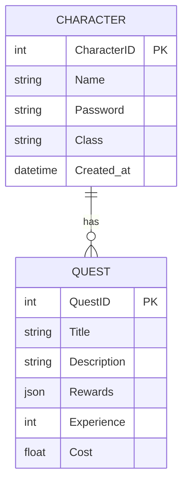

# AI RPG Quest Creator

Proof of concept project showcasing how AI can create real-time video game quests with contextual uniqueness, avoiding the cookie-cutter phenomena.

## How it Works

The Quest Creator utilizes the following process:

## Prompt used:

## PostgreSQL database ERD:

# rpg-quest-adventure
