# Character Creation Process

This document describes the process of creating a character in our web application.

## Process Flow

1. **User Input**: The user enters their character's name, password, and class in the web application.

2. **Web Application Request**: The web application sends a POST request to the backend server. The request is sent to the /character endpoint and includes the character's name, password, and class as data.

3. **Server Processing**: The backend server receives the request and saves the character information in the 'characters' table in the PostgreSQL database.

4. **Database Confirmation**: The database sends a confirmation back to the server once the character information has been successfully saved.

5. **Server Response**: The server sends a response back to the web application, indicating that the character has been created successfully.

6. **User Confirmation**: The web application displays a confirmation to the user, indicating that their character has been created.

## Sequence Diagram

The following sequence diagram illustrates this process:

```mermaid
sequenceDiagram
    participant User as User (webapp)
    participant WebApp as WebApp
    participant Server as Backend Server
    participant DB as Database (Postgres)

    User->>WebApp: Enters: name, password, and class
    WebApp->>Server: HTTP POST /character {name, password, class}
    Server->>DB: Saves character in 'characters'
    DB-->>Server: Confirmation
    Server-->>WebApp: Response: Character created
    WebApp-->>User: Displays confirmation
```

https://www.mermaidchart.com/app/projects/0b40769f-6378-41ce-9e9d-c3aba7ebea19/diagrams/454666c4-fe15-43dd-9501-7f481cc1b16e/version/v0.1/edit
