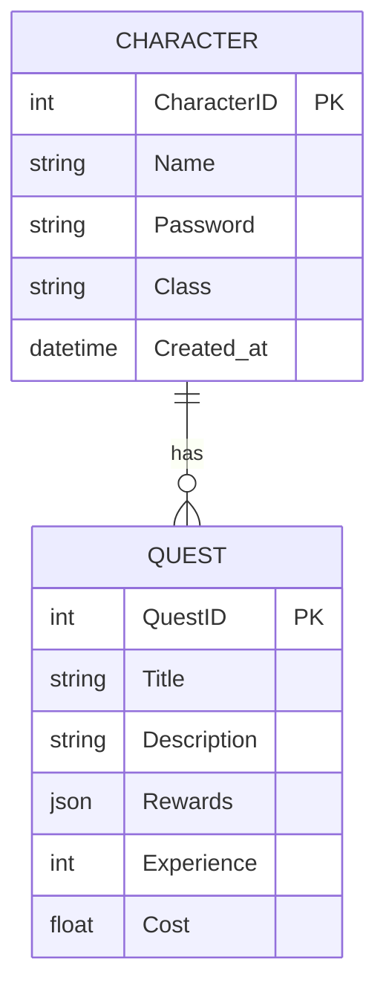

# Database Schema

This document describes the schema of our PostgreSQL database, which includes two tables: `character` and `quest`.

## Tables

### Character

The `character` table stores information about characters. It has the following columns:

- **CharacterID:** An integer that uniquely identifies each character. This is the primary key of the table.
- **Name:** A string that stores the name of the character.
- **Password:** A string that stores the password of the character.
- **Class:** A string that stores the class of the character.
- **Created_at:** A DateTime column representing the date and time when the character was created.

### Quest

The `quest` table stores information about quests. It has the following columns:

- **QuestID:** An integer that uniquely identifies each quest. This is the primary key of the table.
- **Title:** A string that stores the title of the quest.
- **Description:** A string that stores the description of the quest.
- **Rewards:** A JSON column that stores the rewards of the quest.
- **Experience:** An integer that stores the experience points of the quest.
- **Cost:** A Float column representing the monetary cost of the OpenAI API for the quest.

## Relationships

Each character can have multiple quests. This is represented by a one-to-many relationship from `character` to `quest`.

## ER Diagram

The following ER diagram illustrates this schema:

