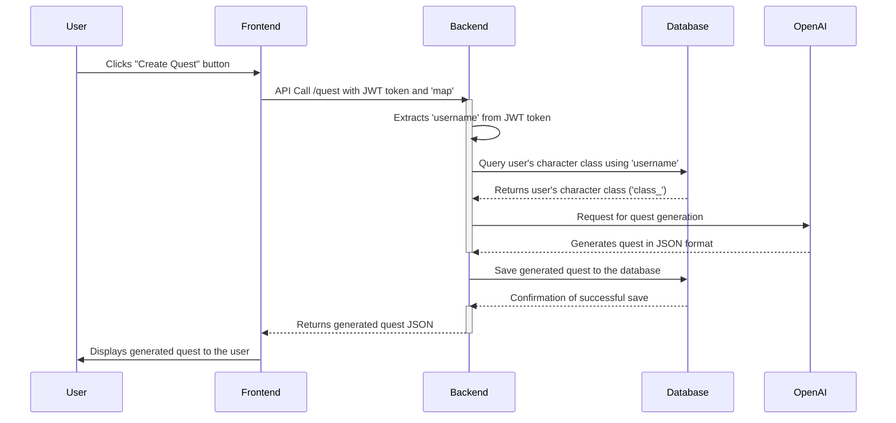

# Quest Generation Process

This document describes the process of generating a quest in our web application.

## Process Flow

1. **User Action:**
   - The user initiates the quest generation process by clicking on the "Create Quest" button on the web application.

2. **Frontend Request:**
   - The frontend initiates an API call to the backend endpoint `/quest`.

3. **Authentication:**
   - The API call includes a JWT token cookie for user authentication.

4. **Token Extraction:**
   - The backend extracts the 'username' from the JWT token cookie.

5. **Database Query:**
   - Using the extracted 'username', the backend performs a database query to retrieve the user's character class ('class_').

6. **OpenAI API Request:**
   - With the values 'username', 'class_', and 'map', the backend constructs a request to the OpenAI API for quest generation.
   - The request includes the parameter `response_format={ "type": "json_object" }` to specify the desired format of the response.

7. **OpenAI API Response:**
   - The OpenAI API responds with a JSON object representing the generated quest, containing details like title, description, rewards, and experience.

8. **Database Save:**
   - The backend saves the received quest JSON object to the database.

9. **Client Response:**
   - The generated quest, now stored in the database, is sent back to the client as a response to the initial API call.

10. **Client Display:**
    - The client receives the quest data and displays it to the user on the web application.

## Sequence Diagram

The following sequence diagram illustrates this process:

