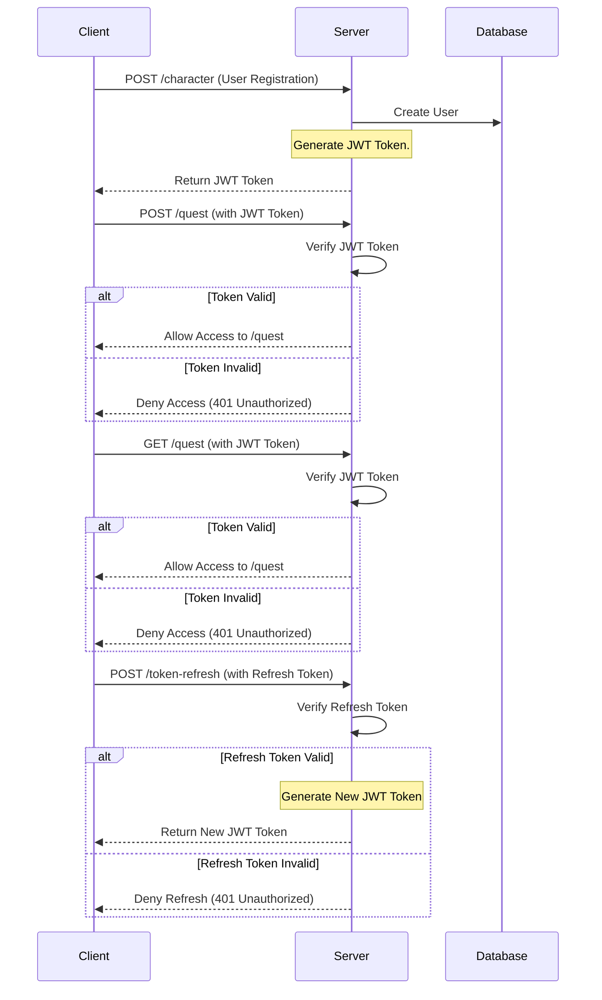

```mermaid
sequenceDiagram
    participant Client
    participant Server
    participant Database

    Client ->> Server: POST /character (User Registration)
    Server ->> Database: Create User

    Note over Server: Generate JWT Token.
    Server -->> Client: Return JWT Token

    Client ->> Server: POST /quest (with JWT Token)
    Server ->> Server: Verify JWT Token

    alt Token Valid
        Server -->> Client: Allow Access to /quest
    else Token Invalid
        Server -->> Client: Deny Access (401 Unauthorized)
    end

    Client ->> Server: GET /quest (with JWT Token)
    Server ->> Server: Verify JWT Token

    alt Token Valid
        Server -->> Client: Allow Access to /quest
    else Token Invalid
        Server -->> Client: Deny Access (401 Unauthorized)
    end

    Client ->> Server: POST /token-refresh (with Refresh Token)
    Server ->> Server: Verify Refresh Token

    alt Refresh Token Valid
        Note over Server: Generate New JWT Token
        Server -->> Client: Return New JWT Token
    else Refresh Token Invalid
        Server -->> Client: Deny Refresh (401 Unauthorized)
    end


```
